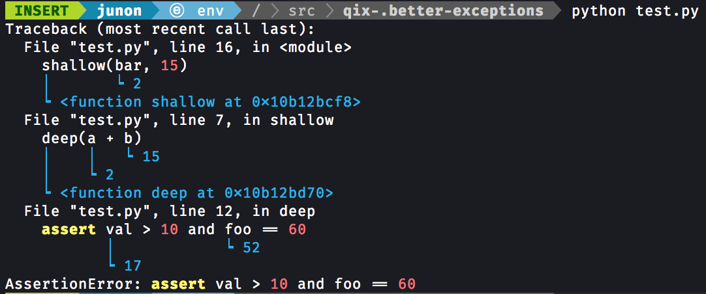

# better-exceptions [](https://travis-ci.org/Qix-/better-exceptions)

Pretty and more helpful exceptions in Python, automatically.



## Usage

Install `ng_exceptions` via pip:

```console
$ pip install ng_exceptions
```

And set the `ng_exceptions` environment variable to any value:

```bash
export ng_exceptions=1  # Linux / OSX
setx ng_exceptions 1    # Windows
```

That's it!

### Python REPL (Interactive Shell)

In order to use `ng_exceptions` in the Python REPL, first install the package (as instructed above) and run:

```console
$ python -m ng_exceptions
Type "help", "copyright", "credits" or "license" for more information.
(BetterExceptionsConsole)
>>>
```

in order to drop into a `ng_exceptions`-enabled Python interactive shell.

### Advanced Usage

If you want to allow the entirety of values to be outputted instead of being truncated to a certain amount of characters:

```python
import ng_exceptions
ng_exceptions.MAX_LENGTH = None
```

While using `ng_exceptions` in production, do not forget to unset the `ng_exceptions` variable to avoid leaking sensitive data in your logs.

### Django Usage

_Tested with Django 1.11_

Create a middleware exception handler in a file like `myapp/middleware.py`:

```python
import sys
from ng_exceptions import excepthook


class BetterExceptionsMiddleware(object):
    def __init__(self, get_response):
        self.get_response = get_response

    def __call__(self, request):
        return self.get_response(request)

    def process_exception(self, request, exception):
        excepthook(exception.__class__, exception, sys.exc_info()[2])
        return None
```

In `settings.py`, add your new class to the `MIDDLEWARE` list:

```python
MIDDLEWARE = [
...
    'myapp.middleware.NgExceptionsMiddleware',
]
```

example output:


## Troubleshooting

If you do not see beautiful exceptions, first make sure that the environment variable does exist. You can try `echo $ng_exceptions` (Linux / OSX) or `echo %ng_exceptions%` (Windows). On Linux and OSX, the `export` command does not add the variable permanently, you will probably need to edit the `~/.profile` file to make it persistent. On Windows, you need to open a new terminal after the `setx` command.

Check that there is no conflict with another library, and that the `sys.excepthook` function has been correctly replaced with the `ng_exceptions`'s one. Sometimes other components can set up their own exception handlers, such as the `python3-apport` Ubuntu package that you may need to uninstall.

Make sure that you have not inadvertently deleted the `ng_exceptions_hook.pth` file that should be in the same place as the `ng_exceptions` folder where all of your Python packages are installed. Otherwise, try re-installing `ng_exceptions`.

You can also try to manually activate the hook by adding `import ng_exceptions; ng_exceptions.hook()` at the beginning of your script.

Finally, if you still can not get this module to work, [open a new issue](https://github.com/Qix-/better-exceptions/issues/new) by describing your problem precisely and detailing your configuration (Python and `ng_exceptions` versions, OS, code snippet, interpeter, etc.) so that we can reproduce the bug you are experiencing.

# License
Copyright &copy; 2017, Josh Junon. Licensed under the [MIT license](LICENSE.txt).
